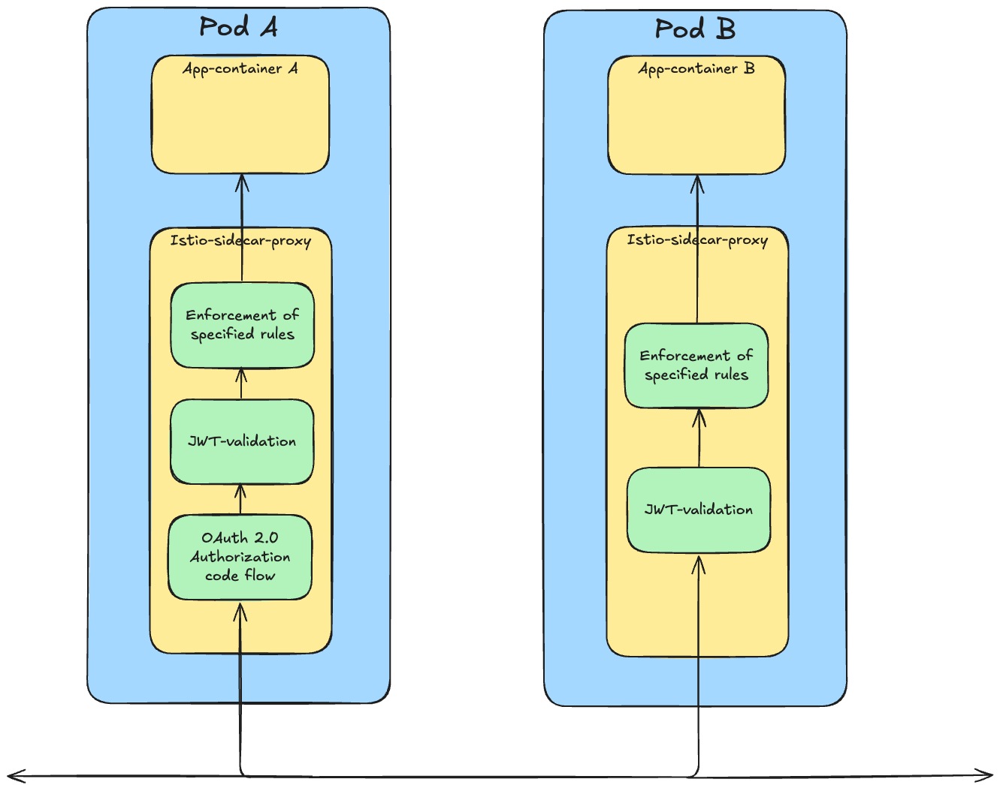

<p align="center">
  
</p>

# Ztoperator

**Ztoperator** is a Kubernetes Operator that simplifies and enforces Zero Trust security for workloads by integrating with **Istio** and **OAuth 2.0**.

At the heart of Ztoperator is the custom resource definition (**CRD**) `AuthPolicy`, which provides a high-level abstraction for configuring authentication and authorization rules using **OAuth 2.0** and **OpenID Connect (OIDC)**.

---

## ✨ Core Functionality

Ztoperator introduces a single CRD: `AuthPolicy`. It allows you to:

- Define authentication and authorization policies for workloads.
- Integrate with any identity provider that supports OAuth 2.0 and OIDC.
- Validate request authenticity using Istio's `RequestAuthentication`.
- Authorize access based on JWT claims using Istio's `AuthorizationPolicy`.
- Optionally support the **OAuth 2.0 Authorization Code Flow** using Envoy’s [OAuth2 filter](https://www.envoyproxy.io/docs/envoy/latest/configuration/http/http_filters/oauth2_filter).

---

### 🔧 Example `AuthPolicy`

The following `AuthPolicy` manifest configures access control for workloads labeled `app: some-app`. 
It integrates with an external OAuth 2.0 and OpenID Connect (OIDC) provider with a well-known endpoint at `https://example.com/.well-known/openid-configuration`, 
enabling JWT-based authentication and claim-based authorization using Istio `RequestAuthentication` and `AuthorizationPolicies`. 
It allows unauthenticated GET requests to `/public` and enforces that GET, POST and PUT towards `/admin` requires an authenticated JWT with the claim `role` set to `admin`. 
It also supports automatic OAuth 2.0 login with specified scopes and redirect/logout paths. Automatic OAuth 2.0 login will trigger on requests towards protected endpoints, 
except for requests towards `/api*` where `denyRedirect` is set to `true`.  

```yaml
apiVersion: ztoperator.kartverket.no/v1alpha1
kind: AuthPolicy
metadata:
  name: auth-policy
spec:
  selector:
    matchLabels:
      app: some-app
  enabled: true
  wellKnownURI: https://example.com/.well-known/openid-configuration
  audience:
    - example-audience
  acceptedResources:
    - https://some-app.com
  autoLogin:
    enabled: true
    logoutPath: /logout
    redirectPath: /oauth2/callback
    scopes:
      - openid
      - profile
  oAuthCredentials:
    clientIDKey: CLIENT_ID
    clientSecretKey: CLIENT_SECRET
    secretRef: oauth-secret
  authRules:
    - paths:
        - /api*
      denyRedirect: true
    - paths:
        - /admin
      methods:
        - GET
        - POST
        - PUT
      when:
        - claim: role
          values:
            - "admin"
  ignoreAuthRules:
    - paths:
        - /public
      methods:
        - GET
```

---

## 🧪 Local Development

Refer to [CONTRIBUTING.md](CONTRIBUTING.md) for instructions on how to run and test Ztoperator locally.

---

## 🔍 How Ztoperator Works

Ztoperator enforces **authentication** and **authorization** for incoming traffic by leveraging Istio's capabilities in combination with **custom EnvoyFilters**. These filters extend the Istio sidecar proxy’s functionality to:

- Handle OAuth 2.0 Authorization Code Flow.
- Validate JWT tokens.
- Enforce access rules based on claims.

The diagram below shows how Ztoperator configures multiple Envoy filters inside the Istio sidecar proxy for each pod. All incoming traffic flows through the sidecar proxy **before reaching the application container**.

- **Pod A** has both authentication/authorization and auto-login enabled.
- **Pod B** has only authentication/authorization enabled (no auto-login).

<picture>
  <source media="(prefers-color-scheme: dark)" srcset="./ztoperator_arch_dark.png">
  
</picture>

---

### 🛠️ EnvoyFilter Execution Order

The Envoy filters are applied in a strict sequence:

1. **`login` filter**: Handles auto-login logic. If login is triggered and successfully performed, it injects an `Authorization` header with a bearer token.
2. **`jwt-auth` filter**: Validates the JWT token included in the request.
3. **`rbac` filter**: Processes access control rules based on claims in the validated JWT.

> [!NOTE]
> The `rbac` filter only evaluates rules **after** successful JWT validation and enforce rules based on claims provided by the `jwt-filter`. If JWT validation fails, the request is denied before RBAC rules are checked.