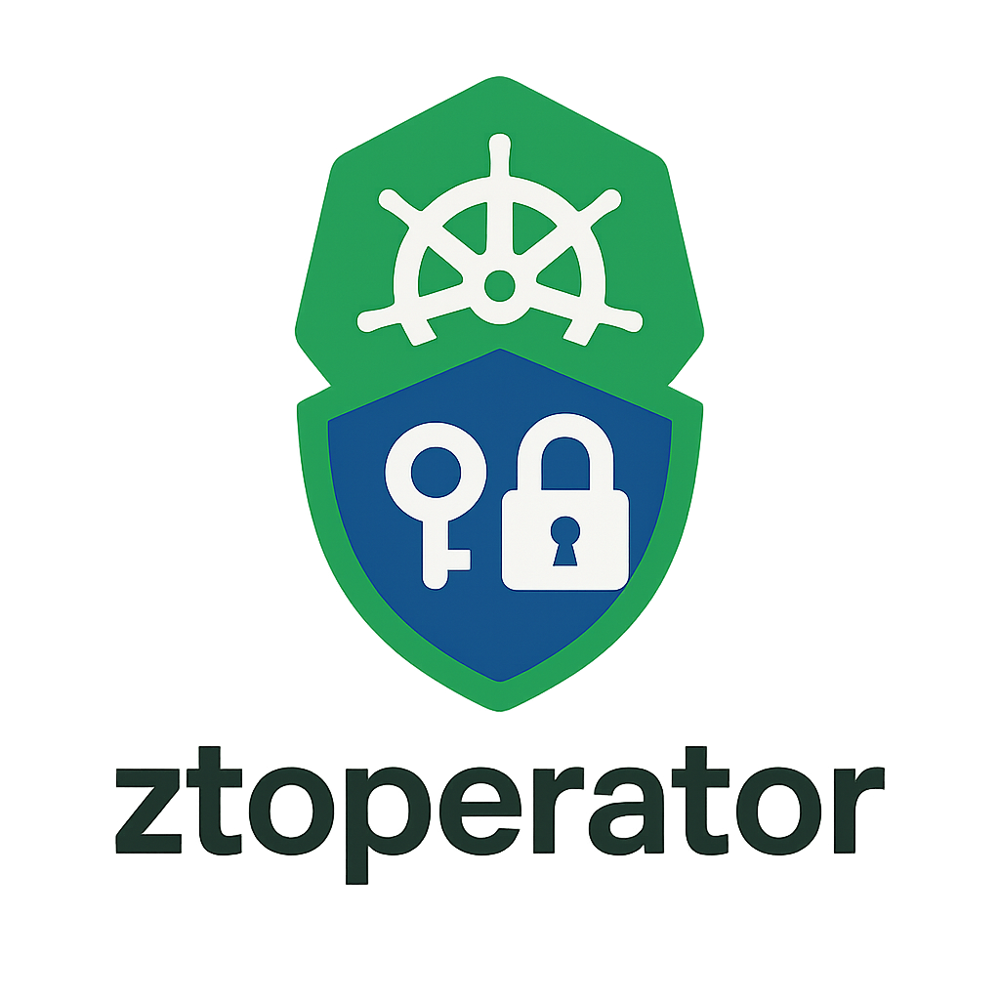

<p>
  
</p>

ztoperator is a Kubernetes operator that simplifies and enforces zero trust security for workloads using Istio and OAuth 2.0. 
At the core of ztoperator is the custom resource definition (CRD) AuthPolicy, which provides an abstraction layer for specifying authentication and authorization rules based on OAuth 2 tokens.


# Core functionality
Ztoperator provides one CRD, AuthPolicy, which configures valid JWT issuers and authorization rules using Istio RequestAuthentication and AuthorizationPolicy.

Example AuthPolicy:
```yaml
apiVersion: ztoperator.kartverket.no/v1alpha1
kind: AuthPolicy
metadata:
  name: auth-policy
spec:
  selector:
    matchLabels:
      app: some-app
  rules:
    - enabled: true
      issuerURI: https://example.com
      jwksURI: https://example.com/jwks
      audience: 
        - example-audience
      acceptedResources:
        - https://some-app.com
      authRules:
        - paths:
            - /api
          methods:
            - GET
          when:
            - claim: sub
              values:
                - "*"
        - paths:
            - /admin
          methods:
            - GET
            - POST
            - PUT
          when:
            - claim: role
              values:
                - "admin"
      ignoreAuthRules:
        - paths:
            - /public
          methods:
            - GET
```

## Local development
Please refer to [CONTRIBUTING.md](CONTRIBUTING.md) on how to run and test ztoperator locally.