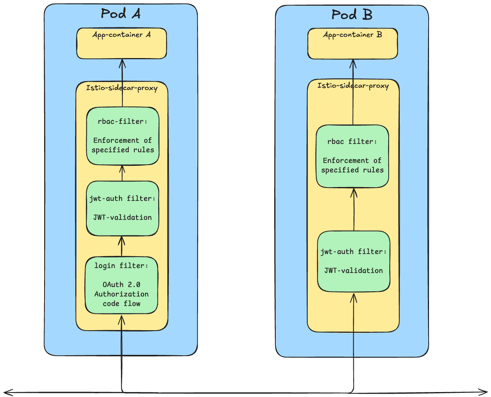

<p align="center">
  
</p>

**Ztoperator** is a Kubernetes Operator that simplifies and enforces Zero Trust security for workloads by integrating with **Istio** and **OAuth 2.0**.

At the heart of Ztoperator is the custom resource definition (**CRD**) `AuthPolicy`, which provides a high-level abstraction for configuring authentication and authorization rules using **OAuth 2.0** and **OpenID Connect (OIDC)**.

## 📚 Table of Contents

- [✨ Core Functionality](#-core-functionality)
- [🔧 Example AuthPolicy](#-example-authpolicy)
- [🧪 Local Development](#-local-development)
- [🔍 How Ztoperator Works](#-how-ztoperator-works)
- [⚡️ Istio Compatibility](#️-istio-compatibility)
- [🛠️ EnvoyFilter Execution Order](#️-envoyfilter-execution-order)
- [📊 Ztoperator Prometheus Metrics](#-ztoperator-prometheus-metrics)


---

## ✨ Core Functionality

Ztoperator introduces a single CRD: `AuthPolicy`. It allows you to:

- Define authentication and authorization policies for workloads.
- Integrate with any identity provider that supports OAuth 2.0 and OIDC.
- Validate request authenticity using [Istio's `RequestAuthentication`](https://istio.io/latest/docs/reference/config/security/request_authentication/).
- Authorize access based on JWT claims using [Istio's `AuthorizationPolicy`](https://istio.io/latest/docs/reference/config/security/authorization-policy/).
- Optionally support the **OAuth 2.0 Authorization Code Flow** using Envoy’s [OAuth2 filter](https://www.envoyproxy.io/docs/envoy/latest/configuration/http/http_filters/oauth2_filter).

## 🔧 Example `AuthPolicy`

The following `AuthPolicy` manifest configures access control for workloads labeled `app: some-app`. 
It integrates with an external OAuth 2.0 and OpenID Connect (OIDC) provider with a well-known endpoint at `https://example.com/.well-known/openid-configuration`.
It allows unauthenticated GET requests to `/public` and enforces that GET, POST and PUT towards `/admin` requires an authenticated JWT with the claim `role` set to `admin`. 
It also supports automatic OAuth 2.0 login with specified scopes and redirect/logout paths. Automatic OAuth 2.0 login will trigger on requests towards protected endpoints, 
except for requests towards `/api*` where `denyRedirect` is set to `true`. Endpoints not explicitly mentioned in the manifest require authentication by default. 

```yaml
apiVersion: ztoperator.kartverket.no/v1alpha1
kind: AuthPolicy
metadata:
  name: auth-policy
spec:
  selector:
    matchLabels:
      app: some-app
  enabled: true
  wellKnownURI: https://example.com/.well-known/openid-configuration
  allowedAudiences:
    - value: static-audience-1
    - value: static-audience-2
    - valueFrom:
        configMapKeyRef:
          name: configmap
          key: AUDIENCE
    - valueFrom:
        secretKeyRef:
          name: secret
          key: AUDIENCE
  acceptedResources:
    - https://some-app.com
  autoLogin:
    enabled: true
    logoutPath: /logout
    redirectPath: /oauth2/callback
    postLogoutRedirectUri: https://some-app.com
    loginParams:
      acr_values: substantial
    scopes:
      - openid
      - profile
  oAuthCredentials:
    clientIDKey: CLIENT_ID
    clientSecretKey: CLIENT_SECRET
    secretRef: oauth-secret
  authRules:
    - paths:
        - /api*
      denyRedirect: true
    - paths:
        - /admin
      methods:
        - GET
        - POST
        - PUT
      when:
        - claim: role
          values:
            - "admin"
  ignoreAuthRules:
    - paths:
        - /public
      methods:
        - GET
```

## 🧪 Local Development

Refer to [CONTRIBUTING.md](CONTRIBUTING.md) for instructions on how to run and test Ztoperator locally.

## 🔍 How Ztoperator Works

Ztoperator enforces **authentication** and **authorization** for incoming traffic by leveraging Istio's capabilities in combination with **custom EnvoyFilters**. These filters extend the Istio sidecar proxy’s functionality to:

- Handle OAuth 2.0 Authorization Code Flow.
- Validate JWT tokens.
- Enforce access rules based on claims.

The diagram below shows how Ztoperator configures multiple Envoy filters inside the Istio sidecar proxy for each pod. All incoming traffic flows through the sidecar proxy **before reaching the application container**.

- **Pod A** has both authentication/authorization and auto-login enabled.
- **Pod B** has only authentication/authorization enabled (no auto-login).

<picture>
  <source media="(prefers-color-scheme: dark)" srcset="./ztoperator_arch_dark.png">
  
</picture>

### ⛰ Mounting OAuth Credentials in the Istio Sidecar

The protected workload must mount a Secret generated by Ztoperator into the `istio-proxy` sidecar to enable the OAuth 2.0 Authorization Code Flow. 
This Secret contains the credentials required by the Envoy OAuth2 filter and follows a naming convention based on the associated AuthPolicy: `<authpolicy-name>-envoy-secret`. 
For example, an AuthPolicy named `auth-policy` will result in a Secret named `auth-policy-envoy-secret`.

For pods, the Secret can be mounted automatically by adding the following annotations:


```yaml
sidecar.istio.io/userVolume: |
  [
    {
      "name": "envoy-secret",
      "secret": {
        "secretName": "<authpolicy-name>-envoy-secret"
      }
    }
  ]
sidecar.istio.io/userVolumeMount: |
  [
    {
      "name": "envoy-secret",
      "mountPath": "/etc/istio/config",
      "readonly": true
    }
  ]
```

These annotations ensure that the generated Secret is mounted into the sidecar at the correct path, allowing Envoy to perform the OAuth 2.0 Authorization Code exchange.


## ⚡️ Istio Compatibility

Ztoperator is tested and compatible with **Istio 1.26 - 1.28**. You should ensure that your cluster is running Istio version 1.26 - 1.28 (any patch release) 
for Ztoperator to function as expected. Other versions of Istio may not be fully supported and could result in unexpected behavior.

## 🛠️ EnvoyFilter Execution Order

The Envoy filters are applied in a strict sequence:

1. **`login` filter**: Handles auto-login logic. If login is triggered and successfully performed, it injects an `Authorization` header with a bearer token.
2. **`jwt-auth` filter**: Validates the JWT token included in the request.
3. **`rbac` filter**: Processes access control rules based on claims in the validated JWT.

> [!NOTE]
> The `rbac` filter only evaluates rules **after** successful JWT validation, and enforce rules based on claims provided by the `jwt-auth` filter. Consequently, if JWT validation fails, the request is denied before authorization rules are checked.

## 📊 Ztoperator Prometheus Metrics

Ztoperator exposes both the **standard out-of-the-box metrics** provided by
[operator-sdk](https://sdk.operatorframework.io/docs/building-operators/golang/advanced-topics/metrics/)
as well as a **custom metric** called `ztoperator_authpolicy_info`.

`ztoperator_authpolicy_info` is a gauge vector with the following labels:

- `name`: Name of the `AuthPolicy`
- `namespace`: Namespace where the `AuthPolicy` resides
- `state`: Observed state of the `AuthPolicy` (`Pending`, `Ready`, `Failed`, `Invalid`)
- `owner`: Value of the `team` label on the namespace resource where the `AuthPolicy` resides
- `issuer`: Configured OAuth 2.0 issuer
- `enabled`: Whether the `AuthPolicy` is enabled
- `auto_login_enabled`: Whether auto-login is enabled
- `protected_pod`: The name of the pod protected by the `AuthPolicy`
- `protected_deployment`: The name of the deployment the protected pod belongs to
